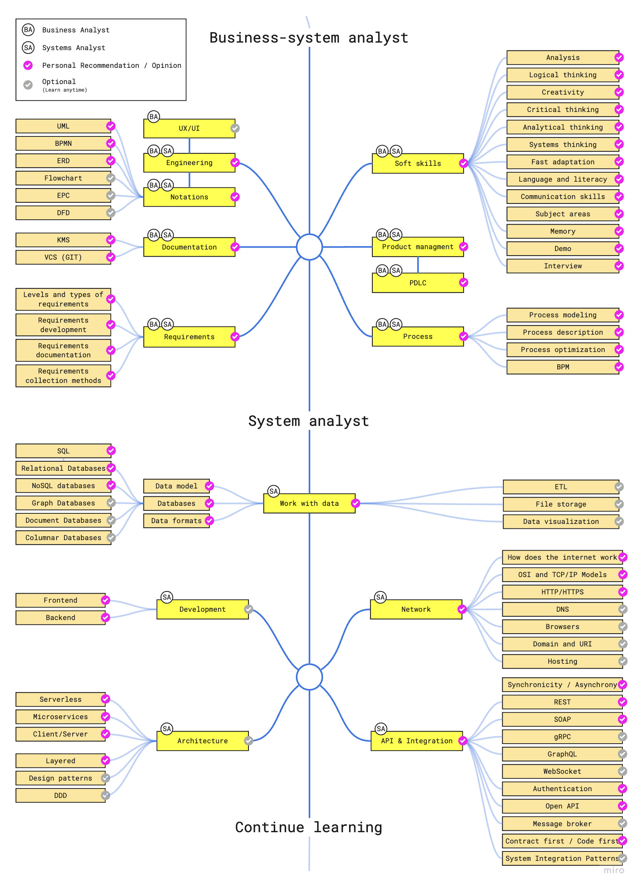

# Roadmap

<figure><figcaption></figcaption></figure>


[README (1).md](<README (1).md>)


## Навигация по Roadmap



<mark style="color:green;">#Бизнес аналитик</mark> <mark style="color:green;">#Системный аналитик</mark>


[gibkie-navyki-soft-skills](basic\_knowledge/gibkie-navyki-soft-skills/)


<table data-view="cards"><thead><tr><th></th><th></th><th></th><th data-hidden data-card-target data-type="content-ref"></th><th data-hidden data-card-cover data-type="files"></th></tr></thead><tbody><tr><td>Анализ (Analysis)</td><td></td><td></td><td><a href="basic_knowledge/gibkie-navyki-soft-skills/analiz-analysis.md">analiz-analysis.md</a></td><td></td></tr><tr><td>Логика (Logic)</td><td></td><td></td><td><a href="basic_knowledge/gibkie-navyki-soft-skills/logicheskoe-myshlenie-logics.md">logicheskoe-myshlenie-logics.md</a></td><td></td></tr><tr><td>Креативность (Creativity)</td><td></td><td></td><td><a href="basic_knowledge/gibkie-navyki-soft-skills/kreativnost-creativity.md">kreativnost-creativity.md</a></td><td></td></tr><tr><td>Критическое мышление (Critical thinking)</td><td></td><td></td><td><a href="basic_knowledge/gibkie-navyki-soft-skills/kriticheskoe-myshlenie-critical-thinking.md">kriticheskoe-myshlenie-critical-thinking.md</a></td><td></td></tr><tr><td>Аналитическое мышление (Analytical thinking)</td><td></td><td></td><td><a href="basic_knowledge/gibkie-navyki-soft-skills/analiticheskoe-myshlenie-analytical-thinking.md">analiticheskoe-myshlenie-analytical-thinking.md</a></td><td></td></tr><tr><td>Системное мышление (System thinking)</td><td></td><td></td><td><a href="basic_knowledge/gibkie-navyki-soft-skills/system_thinking.md">system_thinking.md</a></td><td></td></tr><tr><td>Быстрая адаптация (Fast adaptation)</td><td></td><td></td><td><a href="basic_knowledge/gibkie-navyki-soft-skills/bystraya-adaptaciya-fast-adaptation.md">bystraya-adaptaciya-fast-adaptation.md</a></td><td></td></tr><tr><td>Язык и грамматика (Language and literacy)</td><td></td><td></td><td><a href="basic_knowledge/gibkie-navyki-soft-skills/yazyk-i-grammatika-language-and-literacy.md">yazyk-i-grammatika-language-and-literacy.md</a></td><td></td></tr><tr><td>Навыки коммуникации (Communication skills)</td><td></td><td></td><td><a href="basic_knowledge/gibkie-navyki-soft-skills/navyki-kommunikacii-sommunication-skills.md">navyki-kommunikacii-sommunication-skills.md</a></td><td></td></tr><tr><td>Память (Memory)</td><td></td><td></td><td><a href="basic_knowledge/gibkie-navyki-soft-skills/pamyat-memory.md">pamyat-memory.md</a></td><td></td></tr><tr><td>Интервью (Interview)</td><td></td><td></td><td><a href="basic_knowledge/requirements/metody-sbora-trebovanii.md">metody-sbora-trebovanii.md</a></td><td></td></tr></tbody></table>



<mark style="color:green;">#Бизнес аналитик</mark> <mark style="color:green;">#Системный аналитик</mark>

<table data-view="cards"><thead><tr><th></th><th></th><th></th><th data-hidden data-card-target data-type="content-ref"></th></tr></thead><tbody><tr><td>Требования (Requirements)</td><td></td><td></td><td><a href="basic_knowledge/requirements/">requirements</a></td></tr><tr><td>Проектирование (Engineering/Design)</td><td></td><td></td><td><a href="basic_knowledge/proektirovanie-engineering-design/">proektirovanie-engineering-design</a></td></tr><tr><td>Процесс (Process)</td><td></td><td></td><td><a href="basic_knowledge/process-process/">process-process</a></td></tr><tr><td>Знание предметной области (Domain knowledge)</td><td></td><td></td><td><a href="broken-reference">Broken link</a></td></tr><tr><td>Нотации (Notations)</td><td></td><td></td><td><a href="basic_knowledge/notacii-notations/">notacii-notations</a></td></tr><tr><td>Документирование (Documentation)</td><td></td><td></td><td><a href="basic_knowledge/dokumentirovanie-documentation/">dokumentirovanie-documentation</a></td></tr><tr><td>Управление продуктом</td><td>(Product managment)</td><td></td><td><a href="basic_knowledge/upravlenie-produktom-product-managment.md">upravlenie-produktom-product-managment.md</a></td></tr><tr><td>Жизненный цикл программного продукта (Product Development Life Cycle)</td><td></td><td></td><td><a href="basic_knowledge/zhiznennyi-cikl-programmnogo-produkta-product-development-life-cycle/">zhiznennyi-cikl-programmnogo-produkta-product-development-life-cycle</a></td></tr><tr><td></td><td></td><td></td><td></td></tr></tbody></table>



&#x20;<mark style="color:green;">#Системный аналитик</mark>

<table data-view="cards"><thead><tr><th></th><th></th><th></th></tr></thead><tbody><tr><td>Модель данных (Data model)</td><td></td><td></td></tr><tr><td>Интернет (Network)</td><td></td><td></td></tr><tr><td>API и интеграции (API &#x26; Integration)</td><td></td><td></td></tr><tr><td>Разработка (Development)</td><td></td><td></td></tr><tr><td>Архитектура (Architecture)</td><td></td><td></td></tr></tbody></table>


