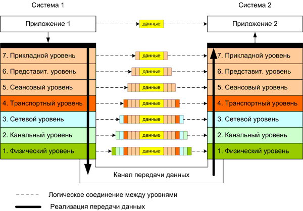

# Модели OSI/ISO и TCP/IP

## Модель OSI/ISO

<figure><figcaption></figcaption></figure>

**Модель OSI/ISO** (Open Systems Interconnection/International Organization for Standardization) — это концептуальная модель, разработанная Международной организацией по стандартизации (ISO), которая определяет стандартный набор протоколов и правил для построения компьютерных сетей. Она была представлена в 1984 году и стала основой для разработки сетевых протоколов.

Модель OSI состоит из семи уровней, каждый из которых выполняет определенные функции, чтобы обеспечить передачу данных от отправителя к получателю в сети. Вот краткое описание каждого уровня:

1. **Физический уровень (Physical Layer):** Он отвечает за физическую передачу данных по среде связи, такую как провод или беспроводный канал. Здесь определяются характеристики электрических, оптических и механических интерфейсов.
2. **Канальный уровень (Data Link Layer):** Этот уровень обеспечивает надежную передачу данных между устройствами в пределах одной локальной сети (LAN). Он осуществляет управление доступом к среде передачи, обнаружение и исправление ошибок и контроль потока данных.
3. **Сетевой уровень (Network Layer):** Здесь выполняется маршрутизация данных в сети. Этот уровень определяет адресацию, маршрутизацию и управление сетевыми ресурсами.
4. **Транспортный уровень (Transport Layer):** Он обеспечивает надежную доставку данных от отправителя к получателю. Этот уровень разделяет данные на более мелкие пакеты, управляет потоком данных и обеспечивает контроль над ошибками.
5. **Сеансовый уровень (Session Layer):** Этот уровень устанавливает, поддерживает и завершает сеансы связи между приложениями на разных узлах сети.
6. **Уровень представления (Presentation Layer):** Он отвечает за перевод, сжатие и шифрование данных, чтобы обеспечить их совместимость и безопасность во время передачи.
7. **Прикладной уровень (Application Layer):** Этот уровень предоставляет интерфейс для приложений, работающих на узлах сети. Некоторые из наиболее известных протоколов на этом уровне включают HTTP для передачи веб-содержимого, SMTP для отправки и получения электронной почты, FTP для передачи файлов, DNS для разрешения доменных имен и другие.

Важно отметить, что модель OSI/ISO является концептуальной моделью и не отражает точную реализацию всех существующих протоколов и технологий в сетевых системах. Однако, она остается важным инструментом для понимания сетевых протоколов и взаимодействия различных уровней сетевой архитектуры.

Посетите следующие ресурсы, чтобы узнать больше:

[https://skillbox.ru/media/code/chto-takoe-model-osi-i-zachem-ona-nuzhna-prepariruem-sloyenyy-pirog-interneta/](https://skillbox.ru/media/code/chto-takoe-model-osi-i-zachem-ona-nuzhna-prepariruem-sloyenyy-pirog-interneta/)

## Модель TCP/IP

**Модель TCP/IP** (Transmission Control Protocol/Internet Protocol) - это сетевая модель, которая описывает принципы передачи данных в компьютерных сетях. Она является основой для организации и взаимодействия сетей в Интернете.

Модель TCP/IP состоит из четырех основных уровней:

1. **Уровень сетевого доступа (Network Access Layer):** Этот уровень определяет методы физической передачи данных через среды связи, такие как Ethernet или Wi-Fi, а также протоколы для управления доступом к среде передачи, такие как Ethernet MAC или Wi-Fi MAC. Он обеспечивает непосредственное подключение устройств к физическим средам передачи данных.
2. **Уровень интернета (Internet Layer):** На этом уровне выполняется маршрутизация пакетов данных в компьютерной сети. Он использует IP (Internet Protocol) для адресации узлов в сети и определяет протоколы, такие как ICMP (Internet Control Message Protocol) для обмена сообщениями об ошибках и настройках сети.
3. **Транспортный уровень (Transport Layer):** Этот уровень обеспечивает надежную доставку данных от отправителя к получателю. Он использует протоколы TCP (Transmission Control Protocol) и UDP (User Datagram Protocol). TCP обеспечивает гарантированную доставку данных с контролем потока и обнаружением ошибок, в то время как UDP обеспечивает безгарантийную доставку без контроля потока.
4. **Прикладной уровень (Application Layer):** На этом уровне находятся приложения и службы, работающие поверх TCP/IP. Они включают протоколы и службы, такие как HTTP (передача гипертекста), FTP (передача файлов), SMTP (почтовый протокол), DNS (система доменных имен) и многие другие.

Модель TCP/IP является широко принятой стандартной моделью для сетей, используемых в Интернете и во многих корпоративных сетях. Она предоставляет гибкую и масштабируемую архитектуру для взаимодействия различных устройств и приложений в сети, позволяя им обмениваться данными и обеспечивать надежную передачу сообщений.

Посетите следующие ресурсы, чтобы узнать больше:

[Что такое TCP/IP: Объясняем на пальцах](https://www.youtube.com/watch?v=2I1HnSN1H9o\&ab\_channel=ListenIT)
